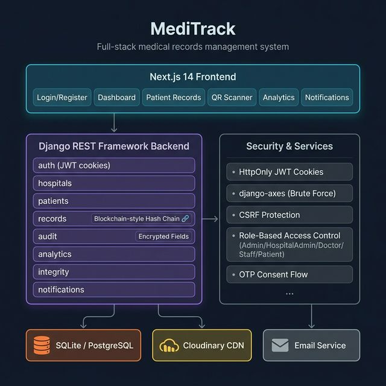

# 🏥 MediTrack

A secure, full-stack medical records management system for hospitals, doctors, staff, and patients.



---

## What is MediTrack?

MediTrack allows hospitals to manage patients, medical records, and staff with robust role-based access control. Key features include:

- 🔐 **Secure auth** — JWT tokens stored in HttpOnly cookies (XSS-safe)
- 🔗 **Tamper-evident records** — blockchain-style SHA-256 hash chain on every approved medical record
- 🔒 **Encrypted fields** — sensitive data (diagnosis, Aadhaar, prescriptions) encrypted at rest
- 📷 **QR patient identity** — every patient gets a unique QR code for fast identification
- 🛡️ **OTP consent** — cross-hospital record access requires patient OTP approval
- 📊 **Analytics dashboard** — role-specific statistics for admins and doctors
- 🚫 **Brute-force protection** — account lockout after 5 failed login attempts

### User Roles

`Admin` · `Hospital Admin` · `Doctor` · `Staff` · `Patient`

---

## Tech Stack

**Backend**
- Python 3.11+ / Django 6 / Django REST Framework
- JWT auth via `djangorestframework-simplejwt` (HttpOnly cookies)
- `django-axes` — brute-force protection
- `django-encrypted-model-fields` — AES field-level encryption
- Cloudinary — media storage (QR codes, profile photos, record files)
- SQLite (dev) / PostgreSQL (production via NeonDB)

**Frontend**
- Next.js 14 (App Router) / React 18
- Tailwind CSS + shadcn/ui
- TanStack Query · React Hook Form · Zod · Axios
- Recharts · Framer Motion

---

## Project Structure

```
project/
├── manage.py
├── requirements.txt
├── .env.example          ← copy to .env and fill in values
│
├── meditrack/            ← Django config (settings, urls)
├── accounts/             ← Auth, users, roles
├── hospitals/            ← Hospital management
├── patients/             ← Patient profiles, vitals, OTP consent
├── records/              ← Medical records & prescriptions
├── audit/                ← Immutable audit log
├── analytics/            ← Dashboard statistics
├── integrity/            ← Hash chain verification
├── notifications/        ← In-app notifications
├── common/               ← Shared utilities & pagination
│
└── meditrack-frontend/   ← Next.js 14 app
    ├── app/              ← Pages (login, register, dashboard, qr)
    ├── components/       ← UI components
    ├── hooks/            ← Custom React hooks
    └── lib/              ← Axios client, utilities
```

---

## How to Run

### Prerequisites
- Python 3.11+
- Node.js 18+

### 1. Backend

```bash
# Create and activate virtual environment
python -m venv .venv
.venv\Scripts\activate        # Windows
# source .venv/bin/activate   # macOS/Linux

# Install dependencies
pip install -r requirements.txt

# Set up environment
copy .env.example .env        # then fill in your values

# Run migrations & start server
python manage.py migrate
python manage.py createsuperuser
python manage.py runserver
```

Backend runs at **http://localhost:8000** · Admin at **http://localhost:8000/admin/**

### 2. Frontend

```bash
cd meditrack-frontend
npm install
# create meditrack-frontend/.env.local with:
# NEXT_PUBLIC_API_URL=http://localhost:8000
npm run dev
```

Frontend runs at **http://localhost:3000**

### Environment Variables

Copy `.env.example` to `.env` and set:

| Variable | Description |
|---|---|
| `SECRET_KEY` | Django secret key |
| `DEBUG` | `True` for dev |
| `DB_ENGINE` | `sqlite` (dev) or `postgres` |
| `CLOUDINARY_*` | Cloudinary cloud name, API key & secret |
| `FIELD_ENCRYPTION_KEY` | Fernet key for encrypted fields |
| `EMAIL_*` | SMTP settings (optional, console backend by default) |
